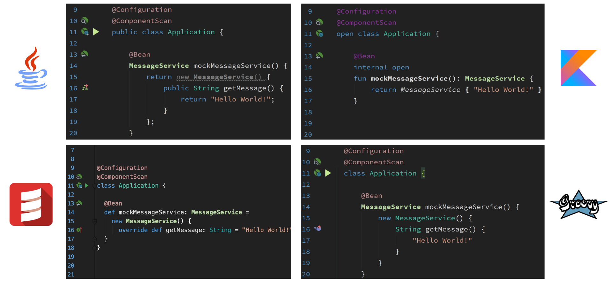
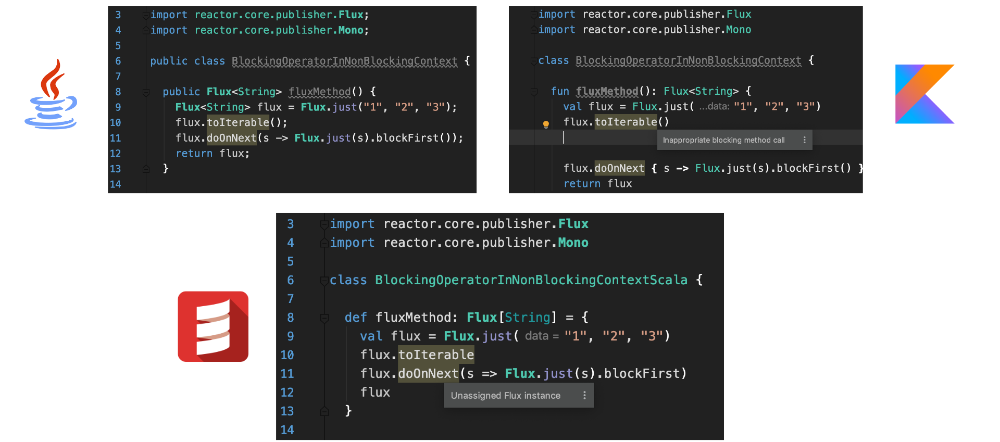
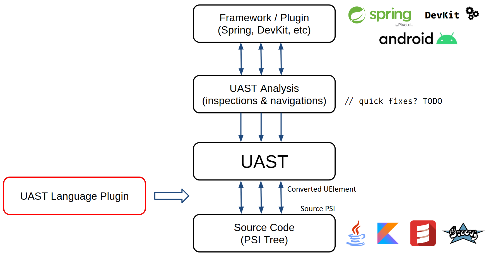
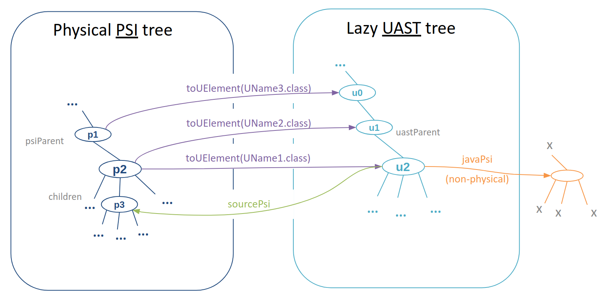

# UAST Docs

## Постановка проблемы

Многие языки программирования разделяют между собой общие семантические конструкции, отличающиеся лишь, возможно, конкретным синтаксисом языка. Например, Java, Kotlin, Scala и Groovy все суть содержат конструкции для объявления классов, методов, полей, if-else выражения (или statements), циклы, вызовы методов и др. Даже Clojure включает в себя подобные средства, несмотря на кардинальные отличия в конкретном синтаксисе и парадигме языка в целом.

Для средств анализа кода (инспекции, навигации, генераторы диаграмм и др.) конкретный синтаксис, как правило, не имеет значения. Взгляните на следующие примеры:



Все 4 фрагмента кода семантически эквивалентны и лишь записаны на разных языках. И для навигации, создающей зелёные иконки, важно лишь, какие элементы Spring фреймворка используются, и при этом в данном случае не имеет значения, на каком конкретно языке записан код, ведь все языки имеют ООП конструкции и средства аннотирования.



Все 3 фрагмента кода семантически эквивалентны. Для инспекции фреймворка Reactor важно только то, какие методы этого фреймворка и в каком контексте вызываются. И снова возможность определять методы и их вызовы есть в любом из представленных языков программирования, а конкретный синтаксис для инспекции не важен.

Ранее для написания инспекций требовалось использовать PSI-структуру для конкретного языка. Таким образом для примеров выше код инспекции пришлось бы написать 4 и 3 раза соответственно, несмотря на то, что они разделяли бы единую логику, не привязанную к конкретному языку. И так для каждой инспекции, которых для одного только Spring-фреймворка в Intellij IDEA больше 50, а так же для навигаций, диаграмм и др.

Для возможности абстрагирования от конкретного синтаксиса и был создан UAST.

## Введение

**UAST** (_Unified Abstract Syntax Tree_) это унифицированный формат представления исходного кода для JVM-языков, включающий в себя самые распространённые языковые конструкции (и только! их). Верно использующие его средства анализа кода начинают автоматически работать для всех языков, для которых реализован UAST Language Plugin.

Говоря формально, UAST является грамматикой с НЕ определенными терминалами, что позволяет абстрагироваться от конкретного синтаксиса, выявив только общую структуру кода, зачастую достаточную для межъязыкового анализа. 

Говоря неформально, UAST это множество интерфейсов для наиболее распространённых в языках синтаксических конструкций.

[UAST Language Plugin](https://upsource.jetbrains.com/idea-ce/file/idea-ce-f95571006c2b9a19d5c11c20d6120101d20342eb/uast/uast-common/src/org/jetbrains/uast/UastLanguagePlugin.kt) предоставляет пользователю возможность получить это унифицированное AST, выполнив преобразование из конкретного синтаксиса. Также теоретически возможно и обратное преобразование для генерации кода конкретного языка из UAST (для межъязыковых конверсий или quickfix-ов), но такая поддержка находится ещё в очень ранней стадии.

Общий порядок работы `UastLanguagePlugin` изображён на следующей схеме:



Схема состоит в следующем:

- Поднимаясь на схеме снизу вверх:
    1. PSI-структура исходного кода с помощью `UastLanguagePlugin` преобразовывается в UAST.
    2. UAST инспекция, принимая на вход UAST узел, выполняет анализ согласно логике фреймворка.
- Опускаясь на схеме сверху вниз:
    3. Для предоставления результатов работы инспекции (warning/gutter) выбирается подходящий UAST элемент.
    4. У UAST элемента запрашивается исходный физический `sourcePsi` элемент, присутствующий в исходном коде, на который вешается итоговый warning/gutter.

## Существующие реализации UAST

| Language | Status                                               |
| -------- | ---------------------------------------------------- |
| Java     | полная поддержка с приоритетом по исправлению ошибок |
| Kotlin   | полная поддержка с приоритетом по исправлению ошибок |
| Scala    | полная поддержка с малым количеством тестом          |
| Groovy   | базовая поддержка деклараций без тел методов         |

## Содержимое UAST Language Plugin

Далее представлена краткая сводка по содержанию пакета [uast-common](https://upsource.jetbrains.com/idea-ce/structure/idea-ce-f95571006c2b9a19d5c11c20d6120101d20342eb/uast/uast-common/src/org/jetbrains/uast):

| Element              | Description   |
| -------------------- | ------------- |
| `analysis`           | _экспериментальная_ технология по простейшему data-flow анализу на UAST с помощью графа |
| `baseElements`       | общие базовые интерфейсы для UAST элементов |
| `controlStructures`  | UAST элементы, представляющие конструкции управления, такие if-else выражение, циклы, try-catch, switch и др. |
| `declarations`       | UAST элементы, представляющие декларации и определения (файл, классы, методы, переменные и др.) |
| `evaluation`         | технология по compile-time вычислению простейших выражений, например, конкатенации строк |
| `expressions`        | UAST элементы, представляющие собой различные выражения |
| `generate`           | _экспериментальная_ технология по генерации кода с помощью UAST, необходимой для, например, написания quick-fix-ов с помощью UAST |
| `internal`           | внутренние утилиты не для публичного использования |
| `kinds`              | набор объектов и перечислений, определяющих вид некоторых выражений, например, вид оператора `UastBinaryOperator` (присвоение, плюс, минус, логическое или и др.) |
| `psi`                | интерфейсы не для публичного пользования, позволяющие в редких случаях UAST-элементу мимикрировать под PSI-элементы |
| `util`               | различные простые утилиты по оперированию UAST-элементами |
| `values`             | интерфейсы для compile-time вычислений, необходимые для `evaluation` и `analysis` |
| `visitor`            | [UAST визитор](#UAST-визитор) |
| `UAnnotationUtils`   | различные утилиты по работе с (вложенными) аннотациями в UAST |
| `UastContext`        | главная точка входа в UAST, см. [UastFacade API](#UastFacade-API) |
| `UastLanguagePlugin` | главный интерфейс UAST Language Plugin |
| `UastUtils`          | утилиты по обходу UAST дерева, поиску предков и резолву UAST элементов |
| `qualifiedUtils`     | утилиты по разбору qualified-выражений, например цепочек вызовов методов |

## Грамматика UAST

Поскольку формально UAST является AST, для него можно выписать [EBNF грамматику](https://drive.google.com/file/d/1gH76sImFFPpz0Nwf4QspNDJ9Glw_-Pru/view?usp=sharing) (с оставленными неопределёнными терминалами). Для записи использовалась та же нотация, что и для [Scala Language Specification](https://www.scala-lang.org/files/archive/spec/2.11/13-syntax-summary.html).

Такая грамматика это просто ёмкая запись существующих интерфейсов для UAST элементов, которая, возможно, будет удобной для людей, привыкших работать с парсерами и AST.

## Принцип работы UAST Language Plugin

Понимание данного раздела является _критически важным_ продуктивной для работы с UAST.

UAST это дерево, построенное поверх PSI и скрывающее его. Работа с UAST-деревом идеалогически абсолютна эквивалентна работе обычных инспекций с PSI-деревом, с точностью до разных имён методов в интерфейсах. Главная и почти единственная трудность заключается в _получении_ UAST-дерева.

В идеальном мире инспекция бы просто получала на вход _полное_ UAST-дерево файла (через объект `UFile` как корень дерева). Но, к сожалению, это технически слишком затратно поскольку:

- потребует вдвое больше памяти на анализ файлов;
- потребует вдвое больше времени на построение необходимых структур;
- потребуется сложная система перестроения UAST-дерева поверх PSI-дерева, аналогично тому, как PSI-дерево перестраивается поверх AST-дерева, что вдвое повысит нагрузку на примитивы синхронизации и кучу JVM;
- наконец, далеко не всем инспекциям требуется полное UAST-дерево файла --- так, если в проекте, например, не применяется Spring, незачем строить UAST деревья тел методов.

Поэтому в существующей реализации UAST-дерево строится _лениво_ (по одному узлу за раз) _по запросу_ (по данному PSI-узлу). Это позволяет экономить ресурсы и даёт дополнительную гибкость, однако привносит ряд неочевидных на первый взгляд явлений.

Важно запомнить следующее 2 главных правила:

1. **Соотношение предок-потомок не обязано сохраняться при преобразовании из PSI в UAST и обратно**
2. **Отображение из PSI в UAST может быть не единственным**

Далее мы приведём множество [примеров](#Наиболее-распространённые-ошибки), иллюстрирующих данное высказывание, а пока поясним его причину:

Говоря формально, преобразование из PSI в UAST не является функтором. Говоря неформально, UAST является более скудным форматом, чем полноценный JVM-язык и по своему дизайну не способен вместить в себя все конструкции всех JVM-языков. Более того, это ещё и потребовало бы знания PSI-структур для данных языков, что является деталями реализации. Поэтому `UastLanguagePlugin` под капотом проводит весьма нетривиальную работу по преобразованию из исходного языка в упрощенное представление и не облагается требованиями по сохранению родственных связей или единственности отображения (см. [UastLanguagePlugin API](#UastLanguagePlugin-API), поскольку в некоторых случаях это просто невозможно.

## UastLanguagePlugin API

Суть `UastLanguagePlugin` сводится к одному единственному [методу](https://upsource.jetbrains.com/idea-ce/file/idea-ce-f95571006c2b9a19d5c11c20d6120101d20342eb/uast/uast-common/src/org/jetbrains/uast/UastLanguagePlugin.kt?nav=2733:2829:focused&line=90&preview=false), непосредственно выполняющему преобразование:

```kotlin
fun convertElementWithParent(element: PsiElement, requiredType: Class<out UElement>?): UElement?
```

Здесь `element` это исходный PSI-элемент, для которого выполняется преобразование. На выходе, если преобразование возможно, мы получим некоторый UAST-узел полного UAST-дерева для данного файла, в противном случае --- `null`. Однако получить элемент наиболее общего типа `UElement` может быть недостаточно, вероятно, мы хотим убедиться, что это будет `UClass`, `UMethod` или другой более конкретный тип узла. Для этого служит параметр `requiredType`: например, если указать его значение как `UClass::class.java`, на выходе, если возможно, будет получен `UElement`, реализующий `UClass`.

Однако это довольно низкоуровневый метод, вместо него рекомендуется пользоваться следующей простейшей его [обёрткой](https://upsource.jetbrains.com/idea-ce/file/idea-ce-f95571006c2b9a19d5c11c20d6120101d20342eb/uast/uast-common/src/org/jetbrains/uast/UastContext.kt?nav=4656:4790:focused&line=185&preview=false), которая найдет подходящую реализацию `UastLanguagePlugin` с помощью `UastFacade` и приведёт результат к указанному типу:

```kotlin
fun <T : UElement> PsiElement?.toUElement(cls: Class<out T>): T? = this?.let { UastFacade.convertElementWithParent(this, cls) as T? }
```

### Неединственность преобразования и convertToAlternatives

В методе `toUElement` кроется неочевидная неприятность: потребовав различные типы результата при преобразовании одного и того же `PsiElement` мы **можем получить различные результаты**! Причина все та же: JVM-языки могут иметь некоторые специальные конструкции, которые в UAST выражаются более, чем одним узлом. Классическим примером являются свойства в языке Kotlin:

```kotlin
class Clazz {
  var foo = 42
}
```

Эквивалентный код на Java будет выглядеть следующим образом:

```java
class Clazz {
  private int _hidden_field_foo = 42;
  public void setFoo(int foo) {
    this._hidden_field_foo = foo;
  }
  public int getFoo() {
    return _hidden_field_foo;
  }
}
```

Таким образом, один `PsiElement` представляет собой и поле, и метод-сеттер, и метод-геттер. Чтобы получить представление этого свойства как поля, необходимо потребовать тип `UField`, чтобы получить представление как метод-геттер, необходимо потребовать тип `UMethod`. А как же тогда получить представление как метод-сеттер?

Для этого существует специальный [метод](https://upsource.jetbrains.com/idea-ce/file/idea-ce-f95571006c2b9a19d5c11c20d6120101d20342eb/uast/uast-common/src/org/jetbrains/uast/UastLanguagePlugin.kt?nav=4445:4561:focused&line=144&preview=false), возвращающий несколько альтернативных вариантов, при наличии таковых:

```kotlin
fun <T : UElement> convertToAlternatives(element: PsiElement, requiredTypes: Array<out Class<out T>>): Sequence<T>
```

Однако это довольно редкий случай и в большинстве случаев простого `toUElement` может быть достаточно. Также применительно к свойствам сейчас ведутся дискуссии, стоит ли добавить в UAST `UProperty`, поскольку это более чем распространённая конструкция, хоть её и нет в Java (по крайней мере пока).

**TODO**: `getMethodCallExpression` и `getConstructorCallExpression`

## UastFacade API

[`UastFacade`](https://upsource.jetbrains.com/idea-ce/file/idea-ce-f95571006c2b9a19d5c11c20d6120101d20342eb/uast/uast-common/src/org/jetbrains/uast/UastContext.kt) это основная точка входа в `UastLanguagePlugin`. 

Технически, это синглтон, реализующий `UastLanguagePlugin`, который в каждом методе по `PsiElement#getLanguage()` ищет соответствующий ему `UastLanguagePlugin` и делегирует последнему вызов метода.

Также `UastFacade` содержит несколько методов, представляющих более сложные точки входа в UAST, нежели преобразование непосредственно переданного элемента:

```kotlin
/**
 * Finds an UAST element of a given type at the given [offset] in the specified file. 
 * Returns `null` if there is no UAST element of the given type at the given offset.
 */
fun <T : UElement> PsiFile.findUElementAt(offset: Int, cls: Class<out T>): T?

/**
 * Finds an UAST element of any given type among the parents of the given PSI element.
 */
@JvmOverloads
fun PsiElement?.getUastParentOfTypes(classes: Array<Class<out UElement>>, strict: Boolean = false): UElement?
```

## UElement API

`UElement` имеет всего 4 наиболее используемых метода:

```kotlin
interface UElement {
  /**
   * Returns the element parent in UAST tree (it is `null` only for [UFile]).
   */
  val uastParent: UElement?

  /**
   * Returns the PSI element in original (physical) tree to which this UElement corresponds.
   * 
   * You should use the returned element only as physical anchor for emitting warnings.
   * Calling any other methods which are not connected with location information is
   * probably an error, consider using [javaPsi] instead.
   * 
   * **Note**: that some UElements are synthetic and do not have an underlying PSI element;
   * this doesn't mean that they are invalid.
   */
  val sourcePsi: PsiElement?

  /**
   * Returns the element which try to mimic Java-api psi element: [com.intellij.psi.PsiClass], [com.intellij.psi.PsiMethod] or [com.intellij.psi.PsiAnnotation] etc.
   * Will return null if this UElement doesn't have Java representation or it is not implemented.
   *
   * In contrast to [sourcePsi] the returned element is probably a non-physical one, as it is
   * usually a synthetic wrapper which implements Java-api. Ideally, in future [javaPsi] will be
   * implemented via JVM-api.
   */
  val javaPsi: PsiElement?

  /**
   * Passes the element to the specified UAST [visitor].
   */
  fun accept(visitor: UastVisitor) {
    visitor.visitElement(this)
    visitor.afterVisitElement(this)
  }

  /* ... other methods */
}
```

Для подробной информации по `UastVisitor` см. [посвящённый ему параграф](#UAST-визитор).

Некоторые типы UAST элементов унаследованы от соответствующих им типов PSI элементов, например:

- `UClass    extends PsiClass`
- `UMethod   extends PsiMethod`
- `UVariable extends PsiVariable`
- и др.

Это архитектурно неверное решение и в скором времени планируется устранить данное наследование. [DevKit плагин](https://jetbrains.org/intellij/sdk/docs/basics/getting_started/using_dev_kit.html) содержит специальную инспекцию, выдающую предупреждение при передаче подобных UAST элементов туда, где ожидаются PSI элементы. Вместо этого пользователю следует явно указать, хочет ли он передать физический `sourcePsi`, не содержащий правильной информации об элементе, или нефизический `javaPsi`, содержащий таковую.   

## Взаимосвязь PSI дерева и UAST дерева 

Ещё раз продублируем два главных правила преобразования, описанных в [Принцип работы UAST Language Plugin](#Принцип-работы-UAST-Language-Plugin):

1. **Соотношение предок-потомок не обязано сохраняться при преобразовании из PSI в UAST и обратно**
2. **Отображение из PSI в UAST может быть не единственным**

Далее представлена простая схема, содержащая несколько неочевидных примеров проявления данных правил:



1. `p2.getParent().toUElement(UName3.class) == u0 != u1 == p2.toUElement(UName1.class).uastParent`

    Иллюстрация правила 1: 
    
    > Соотношение предок-потомок не обязано сохраняться при преобразовании из PSI в UAST
2. `p2.toUElement(UName1.class).sourcePsi == p3 != p2`
 
    Иллюстрация правила 1:
 
    > Соотношение предок-потомок не обязано сохраняться при преобразовании из PSI в UAST **и обратно**
 
    `sourcePsi` не обязательно будет равен исходному PSI элементу, из которого было выполнено преобразование. Это довольно редкий случай, но в некоторых реализациях он, к сожалению, неизбежен. Тем не менее `sourcePsi` все равно будет являться разумным физическим якорем для представления ошибки и не требуется вручную обрабатывать подобные ситуации.
    
    Аналогично, не специфицируется, как будут соотноситься 
    
    - `p2`
    - `u2.uastParent.sourcePsi`
    - `u2.sourcePsi.getParent()`
    
3. `p2.toUElement(UName1.class) == u2 != u1 == p2.toUElement(UName2.class)`

    Иллюстрация правила 2:
    
    > Преобразование может быть [не единственным при указании различных требуемых типов](#Неединственность-преобразования-и-convertToAlternatives).
4. `javaPsi.isPhysical() == ???`

    Рассмотрение предков или потомков `javaPsi` в PSI дереве является неспецифицированным поведением. Используйте `javaPsi` только для получения информации об элементе (имена, модификаторы и т.д.). В идеале в будущем `javaPsi` будет реализован с использованием JVM-api --- таким образом будет доступна полная информация о всех имеющихся названиях и спецификаторах, а информация о положении в исходном коде будет гарантированно недостижима.

## Общая модель работы с UAST

**TODO**

`toUElement` служит в точности и не более чем точкой входа из мира PSI в мир UAST. Как правило, Вы входите в UAST и далее работаете только в рамках него, не возвращаясь обратно в PSI или не пытаясь прийти сюда же из другого PSI элемента.

Мы by design не даём никаких гарантий относительно того, как между собой соотносятся родственные PSI элементы, сконвертированные в UAST, и, обратно, родственные UAST элементы с взятыми у них `sourcePsi`. Это технически невозможно описать и поддерживать, и в большинстве случаев просто не нужно.

Канонический пример работы с Uast следующий: пусть Вы хотите повесить gutter-ы на определенные аннотации фреймворка для классов. Вы берёте `PsiVisitor` и пытаетесь каждый элемент сконвертировать в `UClass` (а скоро мы добавим специальный метод вида `filterPossibleSourcesFor<UClass>()`). Далее у полученных `UClass`-ов, берете аннотации `UAnnotation`, проверяете, что нужно, и на `UAnnotation#sourcePsi` вешаете gutter. Если Вам нужно подсветить определенные вызовы методов, то Вы снова запускаете визитор, пытаетесь получить `UMethod`, и, когда получаете, дальше работаете с `UMethod#body` (т.е. на стороне UAST-а), ищете нужные вызовы, проверяете, что требуется, у них берете `sourcePsi` и вешаете подсветку. 

Как видите, здесь для каждого возможного случая в коде происходит всего **2** перехода между PSI и UAST: изначальный, и конечный, когда уже необходим физический элемент для представления результата.

Если не удаётся реализовать необходимую логику в такой модели работы, напишите нам, возможно, мы попробуем расширить возможности UAST применительно к этому случаю, но скорее всего это знак писать инспекцию отдельно для каждого языка, поскольку требуются слишком специфические подробности, которые UAST всячески скрывает. 

## Пример работы с UAST

**TODO**

## UAST визитор

**TODO**

## Наиболее распространённые ошибки

Ещё раз списком продублируем неочевидные утверждения и проблемы, о которых необходимо помнить, работая с UAST:

1. Соотношение предок-потомок [не обязано сохраняться](#Взаимосвязь-PSI-дерева-и-UAST-дерева) при преобразовании из PSI в UAST и обратно
2. Отображение из PSI в UAST [может быть не единственным](#Взаимосвязь-PSI-дерева-и-UAST-дерева)
3. В редких случаях для получения всех возможных UAST элементов [потребуется использовать метод `convertToAlternatives`](#Неединственность-преобразования-и-convertToAlternatives)
4. `sourcePsi` валиден для использования только [как физический якорь](#UElement-API)
5. [Неспецифицировано соотношение](#Взаимосвязь-PSI-дерева-и-UAST-дерева) `sourcePsi` и PSI элемента, над которым было выполнено преобразование в UAST 
6. `javaPsi` валиден для использования с методами, [сообщающими информацию об элементе](#UElement-API), но не о его физическом положении
7. [Не пользуйтесь фактом наследования](#UElement-API) `UClass` от `PsiClass`, `UMethod` от `PsiMethod` и т.д.

## Internal Actions

> Для использования DevKit action необходимо включить режим разработчика, как описано [в данной статье](https://jetbrains.org/intellij/sdk/docs/reference_guide/internal_actions/enabling_internal.html).

DevKit плагин содержит 2 action-а для UAST:

- `Tools | Internal Actions | UAST | Dump UAST Tree`

    Открывает в редакторе UAST дерево данного файла, сгенерированное с помощью [`UElement#asLogString`](https://upsource.jetbrains.com/idea-ce/file/idea-ce-f95571006c2b9a19d5c11c20d6120101d20342eb/uast/uast-common/src/org/jetbrains/uast/baseElements/UElement.kt?nav=2887:2912:focused&line=154&preview=false) 
- `Tools | Internal Actions | UAST | Dump UAST Tree By Each PsiElement`

    Открывает в редакторе UAST дерево данного файла, сгенерированное с помощью [`IndentedPrintingVisitor`](https://upsource.jetbrains.com/idea-ce/file/idea-ce-f95571006c2b9a19d5c11c20d6120101d20342eb/uast/uast-common/src/org/jetbrains/uast/util/IndentedPrintingVisitor.kt?nav=281:386:focused&line=0&preview=false) 

## Тестирование UAST

Для тестирования инспекций с использованием UAST рекомендуем пользоваться [стандартными подходами IntelliJ Platform](https://jetbrains.org/intellij/sdk/docs/basics/testing_plugins/testing_highlighting.html), проверяющими, что инспекция проанализировала файл так в соответствии с указанной разметкой. 

Если вы строите сложную UAST структуру с множеством резолвов и необходимо удостовериться в детерминированности данного поведения, рекомендуем сериализовать UAST структуру в `String` и сохранить ее в файл. После первого запуска вы можете собственнолично проверить, что результат соответствует вашим ожиданием, а последующие запуски теста будут сравнивать результат сериализации с записанной в файле.

Для сериализации можно воспользоваться одним из следующих методов:

- [`UElement#asLogString`](https://upsource.jetbrains.com/idea-ce/file/idea-ce-f95571006c2b9a19d5c11c20d6120101d20342eb/uast/uast-common/src/org/jetbrains/uast/baseElements/UElement.kt?nav=2887:2912:focused&line=154&preview=false)
- [`UElement#asRenderString`](https://upsource.jetbrains.com/idea-ce/file/idea-ce-f95571006c2b9a19d5c11c20d6120101d20342eb/uast/uast-common/src/org/jetbrains/uast/baseElements/UElement.kt?nav=3176:3220:focused&line=142&preview=false)
- [`qualifiedUtilsKt#asRecursiveLogString`](https://upsource.jetbrains.com/idea-ce/file/idea-ce-f95571006c2b9a19d5c11c20d6120101d20342eb/uast/uast-common/src/org/jetbrains/uast/qualifiedUtils.kt?nav=6932:7028:focused&line=252&preview=false)
- [`IndentedPrintingVisitor`](https://upsource.jetbrains.com/idea-ce/file/idea-ce-f95571006c2b9a19d5c11c20d6120101d20342eb/uast/uast-common/src/org/jetbrains/uast/util/IndentedPrintingVisitor.kt?nav=281:386:focused&line=0&preview=false)

## Альтернативы UAST

Если вам необходимо обрабатывать конструкции, специфические для конкретного языка, или ваша инспекция требовательна по ресурсам, рекомендуется писать инспекцию для каждого из языков отдельно, не прибегая к помощи UAST.

Если вам требуется только информация о декларациях, например, список классов и их методов в файле, с соответствующими им спецификаторами, и нет необходимости итерироваться в телах методов или итерации по дереву, рекомендуем воспользоваться Java-api PSI-типами, такими как `PsiClass`, `PsiMethod`, `PsiPackage`, а также пакетом [Light PSI элементов](https://upsource.jetbrains.com/idea-ce/structure/idea-ce-8fafc580328bc3bbc2e48328721848565487eeee/java/java-psi-impl/src/com/intellij/psi/impl/light) --- несмотря на специфичность для Java многие плагины, такие как Kotlin, Scala, Groovy реализовывают данные интерфейсы для своих PSI-элементов.